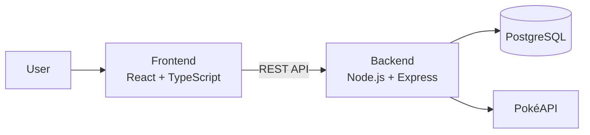
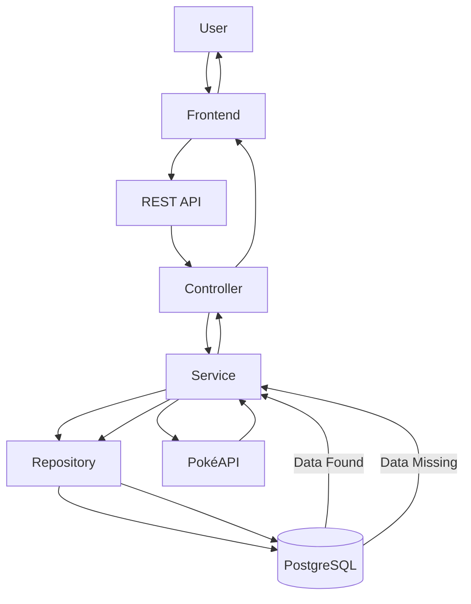

# Architecture

**Project:** PokéDex Manager *(Working Title)*

**Document:** Architecture

**Version:** 0.1.0

**Status:** Draft

**Last Updated:** 2026-07-13

---

## Revision History

| Version | Date | Description |
|----------|------------|----------------------------|
| 0.1.0 | 2026-07-13 | Initial architecture document |

---

## 1. Overview

### Purpose

This document describes the architecture of the PokéDex Manager project, providing a high-level view of the system, its components, and how they interact.

Its purpose is to establish a clear architectural foundation that guides development decisions, promotes consistency, and supports the project's long-term evolution.

---

### Goals

The architecture has been designed to achieve the following goals:

- Maintain a clear separation of responsibilities.
- Support scalability as new features are introduced.
- Encourage code reusability and maintainability.
- Simplify testing and debugging.
- Follow modern Full Stack development practices.
- Provide a solid foundation for future project expansion.
- Promote feature isolation through a modular architecture.

---

### Architectural Principles

The PokéDex Manager architecture is based on the following principles:

- **Separation of Concerns (SoC):** Each layer has a well-defined responsibility.
- **Modularity:** Features are organized into independent modules whenever possible.
- **Maintainability:** The project should be easy to understand, modify, and extend.
- **Scalability:** The architecture should support future growth without major restructuring.
- **Consistency:** Coding standards, project structure, and documentation should remain uniform throughout the project.
- **Simplicity:** Prefer simple and readable solutions over unnecessary complexity.
- **API First:** The frontend and backend communicate exclusively through a well-defined REST API, allowing both applications to evolve independently.
- **Feature-Based Organization:** The application is organized into independent feature modules, each encapsulating its own responsibilities.
  
---

## 2. System Architecture

### High-Level Architecture

PokéDex Manager follows a layered Client-Server architecture.

The frontend is responsible for the user interface and user interactions, while the backend centralizes business logic, data processing, and communication with external services.

Data persistence is handled by a relational database, allowing the application to evolve independently from third-party APIs.

The frontend communicates exclusively with the backend through a REST API.



---

### Client

The client application provides the user interface and is responsible for presenting Pokémon data, handling user interactions, and communicating with the backend through REST API requests.

The frontend does not access the database or external APIs directly.

---

### Server

The backend acts as the central layer of the application.

Its responsibilities include:

- Processing business logic.
- Validating requests.
- Communicating with external APIs.
- Managing application data.
- Providing REST endpoints for the frontend.

---

### Database

The application stores its own data in a PostgreSQL database.

Initially, version 0.1 focuses on read-only Pokémon information obtained from external services.

Future versions will introduce persistent user data, including personal collections, authentication, and Pokémon GO information.

---

### External Services

PokéDex Manager integrates with external services to retrieve Pokémon data.

The primary external data source is the PokéAPI.

External data is intended to synchronize with the local database, reducing dependency on third-party availability and improving response times.

Future versions may introduce additional external services as needed.

---

## 3. Technology Stack

The PokéDex Manager technology stack was selected to provide a modern, scalable, and maintainable Full Stack architecture while leveraging widely adopted technologies and best development practices.

---

### Frontend

| Technology | Purpose |
|------------|---------|
| React | Build a modern, component-based user interface. |
| TypeScript | Provide static typing, improve maintainability, and reduce runtime errors. |
| Vite | Offer a fast development environment and optimized production builds. |
| Tailwind CSS | Enable rapid and consistent UI development through utility-first styling. |
| React Router | Handle client-side navigation. |
| TanStack Query | Manage server state, caching, and asynchronous data fetching. |
| Axios | Simplify communication with the backend REST API. |

---

### Backend

| Technology | Purpose |
|------------|---------|
| Node.js | JavaScript runtime for server-side development. |
| Express | Build a lightweight and scalable REST API. |
| TypeScript | Improve code quality through static typing. |
| Prisma ORM | Provide type-safe database access and simplify data modeling. |

---

### Database

| Technology | Purpose |
|------------|---------|
| PostgreSQL | Store relational application data with reliability, consistency, and scalability. |

---

### External Services

| Service | Purpose |
|---------|---------|
| PokéAPI | Provide Pokémon data used by the application. |

---

### DevOps

| Technology | Purpose |
|------------|---------|
| Docker | Standardize the development environment and simplify deployment. |
| Git | Version control. |
| GitHub | Source code hosting and collaboration. |
| GitHub Actions | Automate workflows such as testing and continuous integration. |

---

### Technology Selection Criteria

The technologies used in this project were selected based on the following criteria:

- Strong community support.
- Long-term maintainability.
- Scalability.
- Type safety.
- Performance.
- Industry adoption.
- Learning opportunities aligned with modern Full Stack development.

---

## 4. Project Structure

The project is organized as a monorepository, separating frontend, backend, database, and documentation into independent modules.

This structure promotes maintainability, scalability, and a clear separation of responsibilities.

---

### Root Structure

```text
pokedex-manager/
│
├── backend/
├── database/
├── docs/
├── frontend/
├── .gitignore
└── README.md
```

---

### Frontend Structure

The frontend follows a feature-oriented structure, separating reusable components, pages, services, and utilities.

```text
frontend/
│
├── public/
├── src/
│   ├── assets/
│   ├── components/
│   ├── hooks/
│   ├── layouts/
│   ├── pages/
│   ├── routes/
│   ├── services/
│   ├── styles/
│   ├── types/
│   ├── utils/
│   ├── App.tsx
│   └── main.tsx
│
├── package.json
└── vite.config.ts
```

---

### Backend Structure

The backend follows a feature-based modular architecture, organizing the application into independent modules that encapsulate their own business logic, routes, and data access.

Shared resources such as configuration, middleware, utilities, and database access are centralized in a dedicated `shared` directory, promoting code reuse and consistency across the application.

```text
backend/
│
├── prisma/
│
├── src/
│   ├── modules/
│   │   ├── pokemon/
│   │   ├── search/
│   │   ├── auth/
│   │   ├── collection/
│   │   └── health/
│   │
│   ├── shared/
│   │   ├── config/
│   │   ├── database/
│   │   ├── middlewares/
│   │   ├── types/
│   │   └── utils/
│   │
│   ├── app.ts
│   └── server.ts
│
├── package.json
└── tsconfig.json
```

---

### Database Structure

Database-related files are stored separately from the backend implementation.

```text
database/
│
├── diagrams/
├── migrations/
├── seeds/
└── README.md
```

---

### Documentation Structure

Project documentation is organized independently from the source code.

```text
docs/
│
├── standards/
│   └── documentation-standards.md
│
├── api.md
├── architecture.md
├── changelog.md
├── contributing.md
├── database.md
├── development-journal.md
├── requirements.md
├── roadmap.md
└── vision.md
```

---

## 5. Module Architecture

Each feature module follows the same internal structure to ensure consistency across the application.

```text
module-name/
│
├── controllers/
├── services/
├── repositories/
├── routes/
├── dto/
├── schemas/
├── types/
└── index.ts
```

### Responsibilities

| Folder | Responsibility |
|---------|----------------|
| controllers | Handle HTTP requests and responses. |
| services | Contain business logic. |
| repositories | Access data sources. |
| routes | Define API endpoints. |
| dto | Define request and response objects. |
| schemas | Validate input data. |
| types | Store module-specific TypeScript types. |
| index.ts | Export the module's public interface. |

---

## 6. Data Flow

The application follows a request-response workflow where the frontend communicates exclusively with the backend through REST API endpoints.

The backend orchestrates the entire request lifecycle, ensuring that business rules, data persistence, and external integrations remain isolated within their respective layers.

Whenever possible, the application prioritizes locally stored data to improve performance and reduce dependency on external services.

---

### Request Flow



---

### Flow Description

1. The user performs an action through the frontend.
2. The frontend sends a request to the backend REST API.
3. The request is handled by the appropriate controller.
4. The controller delegates the request to the service layer.
5. The service requests data from the repository.
6. The repository queries the local PostgreSQL database.
7. If the requested data exists, it is returned to the service.
8. If the data is unavailable or outdated, the service retrieves it from the PokéAPI.
9. The service sends the retrieved data to the repository for persistence.
10. The repository stores the synchronized data in PostgreSQL.
11. The service prepares the response.
12. The controller returns the response to the frontend.
13. The frontend displays the information to the user.

---

### Layer Responsibilities

| Layer | Responsibility |
|--------|----------------|
| Frontend | Render the user interface and communicate with the backend. |
| Controller | Receive HTTP requests and return HTTP responses. |
| Service | Execute business logic and orchestrate application workflows. |
| Repository | Access and persist application data. |
| Database | Store application data. |
| External API | Provide Pokémon data not available locally. |

---

## 7. Design Principles

The PokéDex Manager follows a set of software design principles intended to improve code quality, maintainability, and long-term scalability.

These principles guide architectural decisions and should be respected throughout the development of the project.

---

### Separation of Concerns (SoC)

Each layer and module has a single, well-defined responsibility.

Business logic, data access, presentation, and infrastructure concerns must remain isolated from one another.

---

### Single Responsibility Principle (SRP)

Each class, function, or module should have only one reason to change.

Responsibilities should be clearly divided to simplify maintenance and testing.

---

### Feature-Based Organization

The application is organized into independent feature modules.

Each module encapsulates its own controllers, services, repositories, routes, validation schemas, and types.

---

### API First

Communication between applications occurs exclusively through a well-defined REST API.

The frontend never communicates directly with the database or external services.

---

### Reusability

Reusable components, utilities, and shared services should be centralized whenever possible to reduce code duplication.

---

### Scalability

The architecture should support the addition of new modules and features without requiring significant structural changes.

---

### Maintainability

The codebase should remain easy to understand, modify, and extend throughout the project's lifecycle.

---

### Readability

Code should prioritize clarity over unnecessary complexity.

Consistent naming conventions and coding standards should be followed across the entire project.

---

### Type Safety

TypeScript should be used to provide strong typing across both frontend and backend applications, reducing runtime errors and improving developer experience.

---

### Evolution over Rewrite

The project should evolve incrementally.

Architectural decisions should prioritize extensibility, allowing new features to be added without requiring major refactoring or complete redesigns.

---

## 8. Scalability

The PokéDex Manager architecture has been designed with scalability as a core principle.

The project is expected to evolve incrementally, allowing new features, modules, and integrations to be added without requiring significant architectural changes.

The modular structure and clear separation of responsibilities enable the application to grow while maintaining code quality, readability, and maintainability.

---

### Scalability Goals

The architecture is designed to support:

- New feature modules.
- Additional external services and APIs.
- Increased application complexity.
- Independent frontend and backend evolution.
- Future mobile applications consuming the same REST API.
- Database growth through efficient relational modeling.
- Future performance optimizations, such as caching.

---

### Planned Evolution

The architecture supports the future implementation of features such as:

- User authentication and authorization.
- Personal Pokémon collections.
- Pokémon GO-specific data.
- Team Builder.
- Raid Counter.
- Battle Simulator.
- Community features.
- Notifications.
- Progressive Web App (PWA).
- Native mobile applications.

---

### Long-Term Vision

The project is intended to remain maintainable as it grows.

Whenever possible, new functionality should be implemented by extending the existing modular architecture rather than modifying unrelated modules or introducing breaking structural changes.

This approach minimizes technical debt and preserves architectural consistency throughout the project's lifecycle.

---

### Modular Growth

New functionality should be introduced as independent feature modules whenever possible.

This approach minimizes coupling between different parts of the application and allows the project to evolve without impacting existing features.

Each new module should follow the architectural standards defined for the project, ensuring consistency across the codebase.

---

## 9. Security

Security is considered a fundamental aspect of the PokéDex Manager architecture.

Although the initial version focuses on public Pokémon data, the architecture has been designed to support secure handling of user information and authenticated resources in future releases.

---

### Security Principles

The project follows these security principles:

- Validate all incoming data.
- Never trust client-side input.
- Protect sensitive information.
- Minimize data exposure.
- Follow the principle of least privilege.
- Keep authentication and authorization isolated from business logic.

---

### Application Security

The application is designed to support:

- Secure communication through HTTPS.
- Input validation on all API endpoints.
- Centralized error handling.
- Secure management of environment variables.
- Protection against common web vulnerabilities.

---

### Data Protection

Sensitive information shall never be exposed to the client.

Future versions will ensure:

- Password hashing.
- Secure authentication.
- Protected user data.
- Private personal collections.
- Secure access to protected resources.

---

### Future Security Enhancements

Future versions of the application may include:

- JWT Authentication.
- Role-Based Access Control (RBAC).
- Rate Limiting.
- Request Logging.
- API Monitoring.
- Refresh Tokens.
- Multi-Factor Authentication (MFA).

---

### Security by Design

Security should be considered during the design of every new feature.

New modules must follow the project's security standards, ensuring that authentication, authorization, input validation, and sensitive data handling are incorporated from the beginning rather than added as a later improvement.

---

## 10. Future Architecture

The current architecture has been designed to support the continuous evolution of the PokéDex Manager without requiring major structural changes.

As the project grows, new capabilities should be introduced as independent modules, preserving the existing architecture and maintaining a low level of coupling between features.

---

### Planned Modules

Future versions of the application may introduce modules such as:

- Authentication Module
- Collection Module
- Pokémon GO Module
- PvP Module
- Raid Module
- Team Builder Module
- Battle Simulator Module
- Events Module
- Community Module
- Notification Module

Each module should follow the project's architectural standards and integrate with the existing application through well-defined interfaces.

---

### Future Integrations

The architecture is prepared to support additional integrations, including:

- Pokémon GO data providers.
- Authentication providers.
- Cloud storage services.
- Push notification services.
- Analytics platforms.
- Monitoring and logging solutions.

---

### Future Infrastructure

As the application evolves, the infrastructure may be extended to include:

- Redis for caching.
- Background job processing.
- CDN for static assets.
- Container orchestration.
- Continuous Deployment (CD).
- Monitoring and observability tools.

These additions should be incorporated without requiring significant changes to the application's core architecture.

---

### Architectural Evolution

The project follows an incremental evolution strategy.

Architectural improvements should preserve backward compatibility whenever possible and prioritize extending the existing architecture instead of replacing it.

Every new module or infrastructure component should comply with the architectural and documentation standards established by the project.

---

## 11. Approval

This document defines the official software architecture of the PokéDex Manager project.

All architectural decisions should be aligned with the principles, standards, and guidelines described in this document.

Future modifications should preserve the project's architectural consistency and be documented through the Revision History.