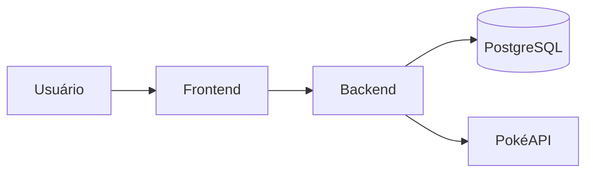

# Arquitetura

> Estado atual: o frontend está implementado e consulta diretamente a PokéAPI. Backend e banco de dados ainda estão planejados.

Este documento descreve como a Minha Pokédex está organizada, como os dados percorrem a aplicação e quais decisões devem orientar sua evolução.

## Visão geral

O projeto utiliza um monorepo com npm Workspaces.

Atualmente, somente o frontend participa do funcionamento da aplicação:

```text
Usuário
→ Frontend
→ PokéAPI
```

O frontend é responsável por:

- navegação;
- apresentação da interface;
- gerenciamento de estado;
- consulta à PokéAPI;
- transformação das respostas externas;
- tratamento de loading, erro e cancelamento.

O backend e o banco de dados serão introduzidos quando o produto precisar de autenticação, coleção pessoal, persistência ou regras de negócio próprias.

## Tecnologias atuais

| Tecnologia     | Responsabilidade                |
| -------------- | ------------------------------- |
| React          | Construção da interface         |
| TypeScript     | Tipagem estática                |
| Vite           | Desenvolvimento e build         |
| React Router   | Navegação entre páginas         |
| CSS            | Estilos, temas e responsividade |
| Fetch API      | Requisições HTTP                |
| npm Workspaces | Organização do monorepo         |
| ESLint         | Análise de código               |
| Prettier       | Formatação                      |
| EditorConfig   | Padronização dos editores       |

## Estrutura do repositório

```text
pokedex-manager/
├── frontend/
├── backend/
├── docs/
├── .vscode/
├── .editorconfig
├── .gitignore
├── .prettierignore
├── LICENSE
├── package.json
├── package-lock.json
└── README.md
```

### `frontend`

Contém a aplicação React atualmente em funcionamento.

### `backend`

Está reservado para a futura API da Minha Pokédex.

A existência da pasta não significa que o backend já esteja implementado.

### `docs`

Contém a documentação funcional, técnica, histórica e de planejamento.

## Organização do frontend

O frontend utiliza uma arquitetura baseada em features.

```text
frontend/src/
├── app/
│   ├── contexts/
│   ├── layouts/
│   ├── providers/
│   └── routes/
├── assets/
├── features/
│   └── pokedex/
│       ├── components/
│       ├── data/
│       ├── hooks/
│       ├── mappers/
│       ├── services/
│       ├── types/
│       └── utils/
├── pages/
├── shared/
│   └── components/
├── styles/
├── App.tsx
├── index.css
└── main.tsx
```

A estrutura pode receber novos diretórios conforme o projeto evoluir. O objetivo não é seguir uma árvore rígida, mas manter responsabilidades claras.

## Responsabilidades

### `app`

Reúne estruturas que afetam toda a aplicação:

- providers;
- contextos globais;
- layouts;
- configuração de rotas.

Exemplos:

- provider de tema;
- layout principal;
- rotas da aplicação;
- layout persistente das rotas da Pokédex.

### `features`

Contém funcionalidades ligadas a um domínio específico.

A feature `pokedex` concentra:

- componentes próprios da Pokédex;
- modelos da API;
- modelos de domínio;
- serviços;
- mappers;
- hooks;
- utilitários;
- dados locais de apoio.

Novas funcionalidades devem ser criadas como features quando possuírem comportamento e responsabilidades próprias.

### `pages`

As páginas realizam a composição da interface.

Elas podem utilizar:

- componentes da feature;
- componentes compartilhados;
- hooks;
- dados fornecidos pelas rotas.

As páginas não devem concentrar transformações de respostas externas.

### `shared`

Contém recursos reutilizáveis que não pertencem exclusivamente a uma feature.

Exemplos:

- `Button`;
- `Card`;
- `Badge`;
- componentes de feedback;
- componentes de layout.

Um componente somente deve ser movido para `shared` quando possuir utilidade real em mais de um contexto.

### `styles`

Contém tokens e estilos globais, incluindo:

- cores;
- espaçamentos;
- tipografia;
- temas;
- estilos base.

## Fluxo de dados

O fluxo principal separa os dados externos dos dados utilizados pela interface:

```text
PokéAPI
→ service
→ API types
→ mapper
→ domain model
→ hook
→ page
→ component
```

### Services

Os services concentram a comunicação com fontes externas.

Responsabilidades:

- montar requisições;
- executar chamadas HTTP;
- utilizar `AbortSignal`;
- interpretar status HTTP;
- coordenar consultas relacionadas;
- entregar dados para transformação.

Os componentes não devem executar requisições diretamente.

### API types

Representam a estrutura recebida da PokéAPI.

Esses tipos podem conter:

- nomes diferentes dos utilizados no domínio;
- campos opcionais;
- URLs vazias;
- estruturas aninhadas;
- informações que não serão exibidas.

Eles não devem ser utilizados diretamente pelos componentes visuais.

### Mappers

Transformam os dados externos em modelos adequados para a aplicação.

Responsabilidades:

- selecionar campos;
- normalizar valores;
- converter estruturas;
- aplicar fallback;
- validar tipos;
- separar regras de transformação da apresentação.

Exemplos:

- transformar uma resposta em `PokemonSummary`;
- montar `PokemonDetails`;
- selecionar e normalizar a descrição da espécie;
- traduzir ou formatar nomes de habilidades;
- converter URLs ausentes em `null`.

### Domain models

Representam os dados utilizados internamente pela aplicação.

Exemplos:

- `PokemonSummary`;
- `PokemonDetails`;
- `PokemonAbility`;
- `PokemonStat`;
- `PokemonSprites`;
- `PokemonListPage`.

Os modelos de domínio devem ser mais simples e previsíveis que as respostas externas.

### Hooks

Os hooks controlam estado e ciclo de vida.

Responsabilidades:

- loading;
- erros;
- retry;
- cancelamento;
- paginação;
- pesquisa;
- prevenção de requisições duplicadas;
- proteção contra respostas antigas;
- exposição de ações para a interface.

Os hooks não devem conhecer detalhes visuais dos componentes.

### Components

Os componentes recebem dados já preparados.

Responsabilidades:

- apresentação;
- interação;
- acessibilidade;
- responsividade.

Componentes visuais não devem:

- acessar estruturas brutas da PokéAPI;
- selecionar idiomas;
- normalizar URLs;
- interpretar códigos HTTP;
- montar regras de paginação.

## Fluxo da listagem

```text
PokemonList
→ usePokemonList
→ pokemonService.getPokemonList
→ PokemonApiListResponse
→ pokemonMapper
→ PokemonListPage
→ PokemonGrid
```

O `usePokemonList` controla:

- Pokémon carregados;
- próximo offset;
- total informado pela API;
- carregamento inicial;
- carregamento adicional;
- erro inicial;
- erro adicional;
- prevenção de páginas repetidas;
- fim dos resultados.

Novas páginas são acumuladas sem substituir os resultados anteriores.

## Fluxo da pesquisa

A pesquisa possui dois comportamentos.

### Filtro local

Durante a digitação:

```text
termo
→ normalização
→ filtro sobre os Pokémon carregados
```

### Pesquisa global exata

Após a confirmação:

```text
termo
→ normalização
→ correspondência exata local
→ consulta remota quando necessária
→ mapper
→ resultado separado
```

O resultado remoto não é inserido na paginação.

Isso preserva:

- contador;
- próximo offset;
- fim da listagem;
- controle de duplicações.

O status `404` é tratado como Pokémon inexistente. Erros de rede ou servidor são tratados como falhas técnicas.

## Fluxo dos detalhes

```text
PokemonDetails
→ usePokemonDetails
→ pokemonService.getPokemonById
→ /pokemon/{id}
→ species.url
→ /pokemon-species/{species}
→ mappers
→ PokemonDetails
→ componentes
```

A resposta principal fornece:

- identificação;
- arte oficial;
- tipos;
- altura;
- peso;
- habilidades;
- estatísticas;
- sprites;
- relação com a espécie.

A resposta da espécie fornece a descrição da Pokédex.

As duas requisições utilizam o mesmo `AbortSignal`.

### Falhas na consulta da espécie

Uma falha técnica ao buscar a espécie não interrompe o carregamento dos dados principais do Pokémon.

Nesse caso:

```ts
description: null;
```

A página continua funcionando e apresenta uma mensagem de indisponibilidade para a descrição.

Falhas na consulta principal de `/pokemon/{id}` continuam interrompendo o carregamento dos detalhes.

### Descrição ausente

Quando a espécie é carregada, mas não possui uma descrição válida:

```ts
description: null;
```

A página continua funcionando e apresenta uma mensagem de indisponibilidade.

## Preservação entre rotas

As rotas:

```text
/pokemon
/pokemon/:pokemonId
```

compartilham um layout persistente.

Esse layout mantém o estado necessário para preservar:

- páginas carregadas;
- próximo offset;
- total da API;
- termo da pesquisa;
- resultado remoto;
- filtro local;
- Pokémon selecionado.

Ao retornar dos detalhes, o card anteriormente aberto pode ser restaurado visualmente com `scrollIntoView`.

Quando os detalhes são acessados diretamente, o retorno utiliza `/pokemon` como fallback.

## Temas

O tema é controlado por um contexto próprio.

Fluxo:

```text
preferência manual
→ localStorage
→ ThemeContext
→ atributo do documento
→ tokens CSS
```

Quando não existe escolha manual, a aplicação utiliza `prefers-color-scheme`.

A interface acompanha alterações do sistema enquanto nenhuma preferência manual estiver definida.

Os componentes devem utilizar tokens semânticos sempre que possível, evitando cores fixas que não funcionem nos dois temas.

## Traduções

As traduções de habilidades utilizam um dicionário local.

Fluxo:

```text
identificador da habilidade
→ normalização
→ dicionário pt-BR
→ fallback formatado em inglês
```

A aplicação não realiza uma nova consulta para cada habilidade.

As descrições da Pokédex utilizam a seguinte prioridade:

```text
pt-br
→ português genérico
→ inglês
→ null
```

A disponibilidade das traduções depende dos dados fornecidos pela PokéAPI e do catálogo local.

## Tratamento de requisições

As requisições devem utilizar `AbortController` quando puderem ser substituídas ou interrompidas.

O cancelamento é usado em situações como:

- desmontagem de um fluxo;
- troca do Pokémon selecionado;
- início de uma nova pesquisa;
- saída da página.

Respostas antigas não devem substituir resultados mais recentes.

Erros cancelados não devem ser apresentados como falhas para o usuário.

## Estados da interface

A aplicação diferencia estados conforme o contexto.

### Listagem

- carregamento inicial;
- erro inicial;
- carregamento adicional;
- erro adicional;
- fim dos resultados;
- conteúdo vazio.

### Pesquisa

- filtragem local;
- pesquisa remota em andamento;
- Pokémon encontrado;
- Pokémon inexistente;
- erro técnico.

### Detalhes

- carregamento;
- erro;
- retry;
- dados disponíveis;
- conteúdo opcional indisponível.

Um erro localizado não deve remover conteúdo que já foi carregado corretamente.

## Acessibilidade

A arquitetura visual deve preservar:

- HTML semântico;
- navegação por teclado;
- foco visível;
- textos alternativos;
- estados comunicados por texto;
- atributos ARIA quando necessários;
- contraste nos temas claro e escuro;
- suporte a diferentes tamanhos de tela.

Informações não devem depender exclusivamente de cor, ícone ou animação.

## Responsividade

A interface utiliza abordagem adaptável para dispositivos móveis e desktop.

Os layouts devem:

- funcionar a partir de 320px;
- evitar rolagem horizontal indevida;
- reorganizar colunas em telas menores;
- manter áreas interativas utilizáveis;
- preservar legibilidade;
- limitar larguras excessivas em telas grandes.

## Decisões atuais

As principais decisões da arquitetura são:

- organização baseada em features;
- separação entre API e domínio;
- transformação por mappers;
- requisições centralizadas em services;
- estado e ciclo de vida controlados por hooks;
- componentes focados em apresentação;
- contextos utilizados apenas para estados compartilhados necessários;
- uso direto da PokéAPI temporariamente;
- evolução incremental em vez de antecipação de toda a arquitetura futura.

## Limitações atuais

- dependência direta da disponibilidade da PokéAPI;
- ausência de cache persistente;
- ausência de backend;
- ausência de banco de dados;
- ausência de autenticação;
- ausência de testes automatizados;
- traduções parciais;
- pesquisa parcial limitada aos Pokémon carregados.

Essas limitações devem ser tratadas conforme o Roadmap, sem adicionar complexidade antes de existir uma necessidade concreta.

## Arquitetura planejada

Quando o projeto introduzir autenticação, coleção pessoal e persistência, o fluxo deverá evoluir para:

```text
Usuário
→ Frontend
→ API da Minha Pokédex
→ Services
→ Banco de dados
→ Serviços externos
```


```mermaid
flowchart LR
    U[Usuário]
    F[Frontend]
    B[Backend]
    DB[(PostgreSQL)]
    P[PokéAPI]

    U --> F
    F --> B
    B --> DB
    B --> P
```

Tecnologias atualmente planejadas:

| Camada         | Tecnologia                    |
| -------------- | ----------------------------- |
| Backend        | Node.js, Express e TypeScript |
| Persistência   | Prisma                        |
| Banco de dados | PostgreSQL                    |

Essas escolhas ainda podem ser revisadas antes da implementação.

## Responsabilidades futuras

### Frontend

- interface;
- interação;
- estado visual;
- comunicação somente com a API interna.

### Backend

- autenticação;
- autorização;
- validação;
- regras de negócio;
- persistência;
- integração com serviços externos;
- composição de respostas para o frontend.

### Banco de dados

- usuários;
- coleções;
- favoritos;
- dados individuais;
- preferências;
- informações próprias da aplicação.

A PokéAPI continuará sendo uma fonte externa, mas o frontend deixará de depender diretamente dela.

## Evolução da arquitetura

Novas camadas e tecnologias somente devem ser introduzidas quando resolverem uma necessidade do produto.

A evolução deve preservar, sempre que possível:

- modelos de domínio;
- separação de responsabilidades;
- contratos dos hooks;
- componentes visuais;
- comportamento já validado.

A introdução do backend deverá substituir a fonte de dados dos services sem exigir uma reconstrução completa da interface.
