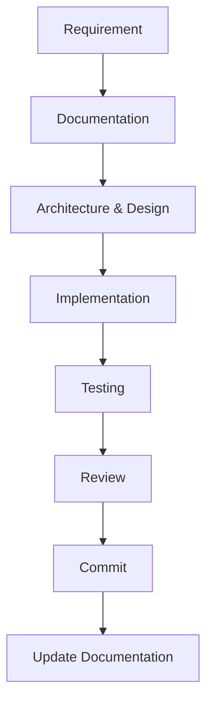
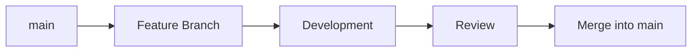
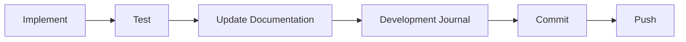
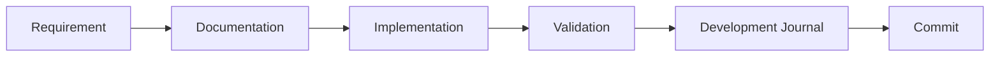
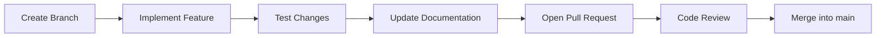
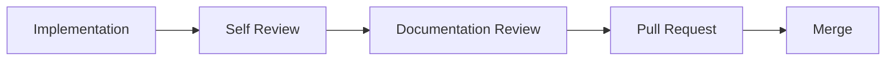

# Contributing

**Project:** PokéDex Manager *(Working Title)*

**Document:** Contributing Guide

**Version:** 0.1.0

**Status:** Draft

**Last Updated:** 2026-07-14

---

## Revision History

| Version | Date | Description |
|----------|------------|------------------------------|
| 0.1.0 | 2026-07-14 | Initial contributing guide |

---

## 1. Purpose

This document defines the development workflow, contribution guidelines, and engineering practices for the PokéDex Manager project.

Its purpose is to establish a consistent development process that promotes code quality, maintainability, collaboration, and long-term project sustainability.

All contributors should follow the standards described in this guide to ensure that new features, bug fixes, documentation updates, and architectural changes remain aligned with the project's vision and technical standards.

This guide complements the project's architecture, documentation standards, roadmap, and database design documents, serving as the primary reference for the software development lifecycle.

---

### Relationship with Other Documents

This guide complements the following project documentation:

- **Vision** — Defines the long-term purpose and goals of the project.
- **Requirements** — Defines the functional and non-functional requirements.
- **Architecture** — Defines the software architecture and technical decisions.
- **Roadmap** — Defines the development milestones and project evolution.
- **Database** — Defines the database architecture and data model.
- **Documentation Standards** — Defines documentation structure, formatting, and writing conventions.

Together, these documents establish the standards that guide every stage of the project's development lifecycle.

---

### Documentation Ecosystem

| Document | Primary Question |
|----------|------------------|
| Vision | Why are we building it? |
| Requirements | What are we building? |
| Architecture | How is it designed? |
| Roadmap | How will it evolve? |
| Database | How is data organized? |
| Contributing | How do we build it? |

---

## 2. Development Workflow

The PokéDex Manager follows a documentation-driven and incremental development workflow.

Every significant change should begin with planning and documentation before implementation, ensuring that architectural decisions remain consistent throughout the project's evolution.

The workflow promotes maintainability, traceability, and long-term project sustainability.

---

### Development Lifecycle



---
### Development Phases

| Phase | Activities |
|--------|------------|
| **Plan** | Requirements, Documentation, Architecture & Design |
| **Build** | Implementation |
| **Validate** | Testing and Code Review |
| **Maintain** | Commit changes and update project documentation |

---

### Workflow Description

1. Define or update the project requirements.
2. Document the proposed solution before implementation.
3. Review architectural and database impacts.
4. Implement the feature following the project's standards.
5. Test the implementation.
6. Review the code for quality and consistency.
7. Commit the changes using the project's commit conventions.
8. Update documentation whenever necessary.

---

### Workflow Principles

The development workflow is guided by the following principles:

- Documentation before implementation.
- Incremental development.
- One logical change at a time.
- Maintain architectural consistency.
- Keep documentation synchronized with the source code.
- Prioritize readability and maintainability over speed.

---

## 3. Branch Strategy

The PokéDex Manager follows a simplified GitHub Flow branching strategy.

Each new feature, bug fix, documentation update, or refactoring should be developed in its own branch before being merged into the `main` branch.

This approach keeps the project's history organized while allowing multiple development efforts to progress independently.

---

### Main Branch

The `main` branch always represents the latest stable version of the project.

Only reviewed and completed work should be merged into this branch.

---

### Feature Branches

New features should be developed in dedicated feature branches.

**Convention:**

```text
feature/<feature-name>
```

Examples:

```text
feature/pokedex-search
feature/pokemon-details
feature/user-authentication
feature/pokemon-go-data
```

---

### Bug Fix Branches

Bug fixes should be isolated in dedicated branches.

**Convention:**

```text
fix/<issue-name>
```

Examples:

```text
fix/search-filter
fix/pokemon-sprites
```

---

### Documentation Branches

Documentation updates should also follow their own branches.

**Convention:**

```text
docs/<topic>
```

Examples:

```text
docs/database
docs/architecture
docs/roadmap
```

---

### Refactoring Branches

Large code improvements without functional changes should use refactoring branches.

**Convention:**

```text
refactor/<module>
```

Examples:

```text
refactor/pokemon-module
refactor/database-services
```

---

### Branch Lifecycle

Every branch should follow the same development lifecycle.



---

### Branch Naming Rules

- Use lowercase letters only.
- Separate words using hyphens (`-`).
- Keep branch names concise and descriptive.
- Use English for all branch names.
- Create one branch per logical change.

---

### Branch Prefixes

| Prefix | Purpose |
|---------|---------|
| `feature/` | New features |
| `fix/` | Bug fixes |
| `docs/` | Documentation updates |
| `refactor/` | Code improvements without changing behavior |
| `test/` | Testing-related work |
| `chore/` | Maintenance tasks and project configuration |

---

## 4. Commit Convention

The PokéDex Manager follows the Conventional Commits specification to maintain a clear, consistent, and meaningful Git history.

Each commit should represent a single logical change and use a standardized prefix to describe its purpose.

---

### Commit Format

All commits should follow the format:

```text
<type>: <short description>
```

Example:

```text
feat: add Pokémon search functionality
fix: resolve evolution chain loading issue
docs: update database architecture
refactor: simplify species service
```

---

### Commit Types

| Type | Purpose |
|------|---------|
| `feat` | Introduces a new feature. |
| `fix` | Fixes a bug or unexpected behavior. |
| `docs` | Updates or adds documentation. |
| `refactor` | Improves code structure without changing behavior. |
| `style` | Applies formatting or style changes without affecting logic. |
| `test` | Adds or updates automated tests. |
| `chore` | Performs maintenance tasks, dependency updates, or project configuration. |

---

### Commit Guidelines

- Write commit messages in English.
- Use the imperative mood (e.g., "add", "update", "remove").
- Keep the subject concise and descriptive.
- Each commit should represent one logical change.
- Avoid combining unrelated changes in a single commit.

---

### Good Examples

```text
feat: add Pokémon details page
feat: implement search filters
fix: correct evolution chain rendering
docs: update roadmap milestones
refactor: reorganize backend modules
test: add species service unit tests
chore: configure ESLint
```

---

### Examples to Avoid

```text
update
changes
fix stuff
misc
new code
```

These messages do not clearly describe the purpose of the commit and should be avoided.

---

### Recommended Commit Workflow

Before creating a commit, contributors should:

1. Verify that the implementation is complete.
2. Ensure the code follows the project's coding standards.
3. Update any affected documentation.
4. Record the completed work in the Development Journal.
5. Create a commit using the project's commit conventions.

This workflow helps maintain synchronization between the source code, documentation, and project history.

---



---

## 5. Coding Standards

The PokéDex Manager follows a consistent set of coding standards to ensure readability, maintainability, scalability, and long-term project quality.

All source code should prioritize clarity over complexity and remain consistent across all application modules.

---

### General Principles

All code should follow these general principles:

- Write clean, readable, and self-explanatory code.
- Prefer simplicity over unnecessary complexity.
- Follow the project's architectural guidelines.
- Keep functions and classes focused on a single responsibility.
- Avoid duplicated logic whenever possible.
- Favor composition over inheritance when appropriate.
- Write code that is easy to understand before optimizing for performance.

---

### Language Standards

The project uses TypeScript as the primary programming language.

All new code should:

- Use strict TypeScript typing.
- Avoid the `any` type whenever possible.
- Prefer explicit types over implicit behavior.
- Use modern ECMAScript features supported by the project.

---

### Code Formatting

Code formatting should be handled automatically whenever possible.

The project adopts the following tools:

| Tool | Purpose |
|------|---------|
| ESLint | Static code analysis and quality enforcement. |
| Prettier | Automatic code formatting. |
| EditorConfig | Consistent editor configuration across environments. |

Developers should avoid manual formatting when automated tools are available.

---

### Naming Conventions

Code identifiers should follow consistent naming conventions.

| Element | Convention | Example |
|---------|------------|---------|
| Variables | camelCase | `pokemonName` |
| Functions | camelCase | `getPokemonById()` |
| Classes | PascalCase | `PokemonService` |
| Interfaces | PascalCase | `PokemonResponse` |
| Enums | PascalCase | `PokemonType` |
| Constants | UPPER_SNAKE_CASE | `MAX_RESULTS` |
| Files | kebab-case | `pokemon-service.ts` |
| Folders | kebab-case | `pokemon-details` |

---

### Project Structure

Source code should follow the project's modular architecture.

Each module should remain independent and encapsulate its own:

- Controllers
- Services
- Repositories
- Routes
- Types
- Validation
- Tests

Cross-module dependencies should be minimized whenever possible.

---

### Error Handling

Errors should be handled consistently throughout the application.

Developers should:

- Return meaningful error messages.
- Avoid silent failures.
- Validate inputs before processing.
- Log unexpected errors appropriately.
- Never expose sensitive information to end users.

---

### Code Quality

Every implementation should be reviewed before being committed.

Developers should verify that:

- The code compiles successfully.
- Linting passes without errors.
- Formatting follows project standards.
- The implementation aligns with the project architecture.
- Documentation is updated when necessary.

---

### Clean Code Principles

The project adopts the following Clean Code principles:

- Prefer descriptive names.
- Keep functions small and focused.
- Avoid deep nesting.
- Eliminate duplicated code.
- Write self-documenting code.
- Minimize side effects.
- Prefer readability over clever solutions.

Every code review should prioritize long-term maintainability over short-term implementation speed.

Whenever a simpler, cleaner, or more maintainable solution exists, it should be preferred.

---

## 6. Documentation

Documentation is considered an integral part of the software development process.

Every significant architectural, functional, or structural change should be documented before or alongside its implementation, ensuring that the project's documentation remains accurate and synchronized with the source code.

Project documentation should evolve continuously throughout the application's lifecycle.

---

### Documentation Principles

The project's documentation follows these principles:

- Documentation is part of the development process.
- Documentation should evolve together with the source code.
- Architectural decisions should be recorded before implementation.
- Documentation should prioritize clarity and consistency.
- Every significant change should be traceable.
- Documentation should remain accessible and easy to maintain.

---

### Documentation Responsibilities

Contributors are responsible for ensuring that documentation remains consistent with the current state of the project.

Whenever necessary, updates should be made to:

- Requirements
- Architecture
- Roadmap
- Database
- Development Journal
- README
- Contributing Guide

---

### Documentation Workflow

Documentation updates should follow the project's development workflow.



---

### Documentation Standards

All project documentation should follow the standards defined in the **Documentation Standards** document.

This includes:

- Document structure
- Formatting
- Naming conventions
- Revision history
- Writing style
- Mermaid diagrams
- Versioning

---

### Synchronization

Project documentation and source code should remain synchronized at all times.

Whenever a change affects the project's behavior, architecture, database, or development process, the corresponding documentation should be reviewed and updated before the changes are committed.

---

### Documentation Quality

Documentation should be:

- Accurate
- Consistent
- Complete
- Understandable
- Version-controlled
- Easy to maintain

Documentation should explain not only **what** was implemented, but also **why** important decisions were made.

---

> **Project Principle**
>
> Documentation is not a by-product of software development.
> It is an essential part of the development process.

---

## 7. Pull Requests

Pull Requests (PRs) provide a structured process for reviewing, discussing, and integrating changes into the project.

Although the project may initially be developed by a single contributor, all significant changes should follow the Pull Request workflow whenever possible to maintain code quality and project consistency.

---

### Pull Request Principles

Every Pull Request should:

- Represent a single logical change.
- Follow the project's branch strategy.
- Be reviewed before merging.
- Maintain consistency with the project architecture.
- Include any necessary documentation updates.

---

### Pull Request Workflow



---

### Pull Request Checklist

Before opening a Pull Request, contributors should verify that:

- The implementation is complete.
- The code follows the project's coding standards.
- Documentation has been updated when necessary.
- The project builds successfully.
- Tests pass successfully.
- No unnecessary files are included.
- Commit messages follow the project's commit convention.

---

### Review Guidelines

During the review process, contributors should evaluate:

- Code readability.
- Architectural consistency.
- Compliance with project standards.
- Error handling.
- Documentation updates.
- Overall maintainability.

Reviews should focus on improving the long-term quality of the project rather than simply approving code changes.

---

### Merge Policy

A Pull Request should only be merged when:

- The implementation satisfies the proposed requirements.
- All review comments have been addressed.
- Documentation and source code are synchronized.
- The project remains in a stable state after the merge.

The `main` branch should always represent a stable and functional version of the project.

---

### Development Traceability

Every implemented feature should be traceable throughout the project's development process.

The recommended workflow is:

```text
Roadmap
    ↓
Issue
    ↓
Branch
    ↓
Pull Request
    ↓
Merge
```

This traceability helps document the origin, implementation, and integration of every significant project change.

---

> **Note**
>
> Even when working individually, contributors are encouraged to use Pull Requests as a self-review mechanism before merging changes into the `main` branch.

---

## 8. Issue Management

Issues are used to organize, prioritize, and track the development of the PokéDex Manager project.

Each significant feature, bug fix, improvement, or documentation update should be represented by an issue before implementation begins.

Issues provide traceability throughout the project's development lifecycle and help maintain alignment with the roadmap and project goals.

---

### Review Checklist


---

### Issue Categories

| Category | Purpose |
|----------|---------|
| Feature | New functionality |
| Bug | Bug fixes |
| Enhancement | Improvements to existing functionality |
| Documentation | Documentation updates |
| Refactor | Code improvements without changing behavior |
| Chore | Maintenance and project configuration |

---

### Issue Guidelines

Every issue should:

- Have a clear and descriptive title.
- Define a single objective.
- Be linked to a roadmap milestone whenever applicable.
- Include enough information to guide implementation.
- Be closed only after the related work has been completed and merged.

---

## 9. Code Review

Code reviews are an essential part of the development process and help ensure the quality, consistency, and maintainability of the PokéDex Manager project.

Every significant change should be reviewed before being merged into the `main` branch.

The primary goal of a code review is to improve the implementation while ensuring alignment with the project's architecture, coding standards, and long-term vision.

---

### Review Principles

Code reviews should focus on:

- Code readability.
- Maintainability.
- Architectural consistency.
- Correctness.
- Simplicity.
- Long-term sustainability.

Reviews should aim to improve the project rather than simply approve changes.

---

### Review Checklist

Before approving a change, verify that:

- The implementation satisfies the proposed requirements.
- The solution follows the project's architecture.
- The code complies with the coding standards.
- Documentation has been updated when necessary.
- The implementation is easy to understand and maintain.
- No unnecessary complexity has been introduced.
- Error handling is appropriate.
- The project remains stable after the changes.

---

### Self-Review

When working individually, contributors should perform a self-review before merging changes.

The self-review should verify:

- Code quality.
- Naming consistency.
- Project structure.
- Documentation updates.
- Compliance with project standards.

Self-review helps identify issues before they become part of the project's history.

---

### Review Workflow



---

### Continuous Improvement

Code reviews should encourage continuous improvement throughout the project.

Whenever a cleaner, simpler, or more maintainable solution is identified, it should be preferred over the initial implementation whenever practical.

---

### Review Philosophy

The purpose of a review is not only to identify problems, but also to encourage learning and continuous improvement.

Constructive feedback should be welcomed, and technical discussions should prioritize the long-term quality of the project over personal preferences or implementation speed.

---

## 10. Development Environment

The PokéDex Manager project uses a standardized development environment to ensure consistency across all contributors.

Developers should use the project's recommended tools, technologies, and configurations to minimize environment-specific issues and maintain compatibility throughout the development lifecycle.

---

### Core Technologies

| Technology | Purpose |
|------------|---------|
| Node.js | JavaScript runtime environment |
| TypeScript | Primary programming language |
| React | Frontend framework |
| Vite | Frontend build tool |
| Express | Backend framework |
| PostgreSQL | Relational database |
| Prisma ORM | Database access and migrations |
| Git | Version control |

---

### Development Tools

| Tool | Purpose |
|------|---------|
| Visual Studio Code | Recommended code editor |
| ESLint | Static code analysis |
| Prettier | Code formatting |
| EditorConfig | Editor configuration |
| GitHub | Source code hosting and collaboration |

---

### Environment Configuration

Developers should ensure that their local environment is properly configured before contributing to the project.

The recommended development environment includes:

- Node.js (LTS version)
- PostgreSQL
- Git
- Visual Studio Code (recommended)
- npm as the package manager

Project-specific configuration files should be respected, including:

- `.editorconfig`
- `.gitignore`
- `eslint.config.*`
- `prettier.config.*`
- `.env.example`

---

### Environment Principles

The development environment should remain:

- Consistent across contributors.
- Easy to configure.
- Reproducible.
- Version-controlled whenever possible.
- Independent of individual operating systems.

---

### Environment Evolution

As the project evolves, additional development tools and services may be introduced.

Examples include:

- Docker
- GitHub Actions
- Continuous Integration (CI)
- Continuous Deployment (CD)
- Automated Testing
- Code Coverage

---

> **Note**
>
> The development environment should evolve together with the project. New tools should only be adopted when they provide clear benefits to the development process and remain aligned with the project's architecture and engineering practices.

---

## 11. Best Practices

The following best practices represent the engineering principles that guide the development of the PokéDex Manager project.

These practices are intended to promote consistency, maintainability, and long-term sustainability throughout the project's lifecycle.

---

### Software Development

Contributors should:

- Prefer simple solutions over unnecessary complexity.
- Follow the project's architecture and design principles.
- Write clean, readable, and maintainable code.
- Keep implementations focused on a single responsibility.
- Avoid code duplication whenever possible.
- Prioritize long-term maintainability over short-term convenience.

---

### Documentation

Contributors should:

- Keep documentation synchronized with the source code.
- Document significant decisions before implementation.
- Update affected documents whenever project behavior changes.
- Follow the project's documentation standards.

---

### Collaboration

Contributors should:

- Communicate technical decisions clearly.
- Welcome constructive feedback.
- Respect established project conventions.
- Prioritize the project's quality over personal preferences.

---

### Continuous Improvement

The project encourages continuous improvement.

Whenever a better solution is identified, contributors should evaluate whether it:

- Improves maintainability.
- Simplifies the implementation.
- Preserves architectural consistency.
- Adds long-term value to the project.

Improvements should be adopted when they provide clear benefits without introducing unnecessary complexity.

---

### Project Principles

The PokéDex Manager is guided by five fundamental principles:

1. **Plan before building.**
2. **Document before implementing.**
3. **Keep the architecture consistent.**
4. **Build incrementally.**
5. **Always prioritize quality over speed.**

---

## 12. Approval

This document defines the official development guidelines for the PokéDex Manager project.

All contributors are expected to follow the workflows, standards, conventions, and best practices established in this guide to ensure consistency, maintainability, and long-term project sustainability.

This guide should evolve alongside the project, remaining aligned with the project's architecture, documentation, and engineering principles.

Future revisions should preserve the project's commitment to quality, collaboration, and continuous improvement while supporting the long-term vision of the PokéDex Manager.

---