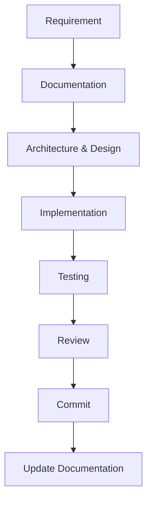
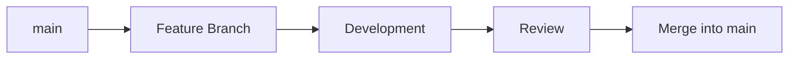

# Contributing

**Project:** PokéDex Manager *(Working Title)*

**Document:** Contributing Guide

**Version:** 0.1.0

**Status:** Draft

**Last Updated:** 2026-07-14

---

## Revision History

| Version | Date | Description |
|----------|------------|------------------------------|
| 0.1.0 | 2026-07-14 | Initial contributing guide |

---

## 1. Purpose

This document defines the development workflow, contribution guidelines, and engineering practices for the PokéDex Manager project.

Its purpose is to establish a consistent development process that promotes code quality, maintainability, collaboration, and long-term project sustainability.

All contributors should follow the standards described in this guide to ensure that new features, bug fixes, documentation updates, and architectural changes remain aligned with the project's vision and technical standards.

This guide complements the project's architecture, documentation standards, roadmap, and database design documents, serving as the primary reference for the software development lifecycle.

---

### Relationship with Other Documents

This guide complements the following project documentation:

- **Vision** — Defines the long-term purpose and goals of the project.
- **Requirements** — Defines the functional and non-functional requirements.
- **Architecture** — Defines the software architecture and technical decisions.
- **Roadmap** — Defines the development milestones and project evolution.
- **Database** — Defines the database architecture and data model.
- **Documentation Standards** — Defines documentation structure, formatting, and writing conventions.

Together, these documents establish the standards that guide every stage of the project's development lifecycle.

---

### Documentation Ecosystem

| Document | Primary Question |
|----------|------------------|
| Vision | Why are we building it? |
| Requirements | What are we building? |
| Architecture | How is it designed? |
| Roadmap | How will it evolve? |
| Database | How is data organized? |
| Contributing | How do we build it? |

---

## 2. Development Workflow

The PokéDex Manager follows a documentation-driven and incremental development workflow.

Every significant change should begin with planning and documentation before implementation, ensuring that architectural decisions remain consistent throughout the project's evolution.

The workflow promotes maintainability, traceability, and long-term project sustainability.

---

### Development Lifecycle



---
### Development Phases

| Phase | Activities |
|--------|------------|
| **Plan** | Requirements, Documentation, Architecture & Design |
| **Build** | Implementation |
| **Validate** | Testing and Code Review |
| **Maintain** | Commit changes and update project documentation |

---

### Workflow Description

1. Define or update the project requirements.
2. Document the proposed solution before implementation.
3. Review architectural and database impacts.
4. Implement the feature following the project's standards.
5. Test the implementation.
6. Review the code for quality and consistency.
7. Commit the changes using the project's commit conventions.
8. Update documentation whenever necessary.

---

### Workflow Principles

The development workflow is guided by the following principles:

- Documentation before implementation.
- Incremental development.
- One logical change at a time.
- Maintain architectural consistency.
- Keep documentation synchronized with the source code.
- Prioritize readability and maintainability over speed.

---

## 3. Branch Strategy

The PokéDex Manager follows a simplified GitHub Flow branching strategy.

Each new feature, bug fix, documentation update, or refactoring should be developed in its own branch before being merged into the `main` branch.

This approach keeps the project's history organized while allowing multiple development efforts to progress independently.

---

### Main Branch

The `main` branch always represents the latest stable version of the project.

Only reviewed and completed work should be merged into this branch.

---

### Feature Branches

New features should be developed in dedicated feature branches.

**Convention:**

```text
feature/<feature-name>
```

Examples:

```text
feature/pokedex-search
feature/pokemon-details
feature/user-authentication
feature/pokemon-go-data
```

---

### Bug Fix Branches

Bug fixes should be isolated in dedicated branches.

**Convention:**

```text
fix/<issue-name>
```

Examples:

```text
fix/search-filter
fix/pokemon-sprites
```

---

### Documentation Branches

Documentation updates should also follow their own branches.

**Convention:**

```text
docs/<topic>
```

Examples:

```text
docs/database
docs/architecture
docs/roadmap
```

---

### Refactoring Branches

Large code improvements without functional changes should use refactoring branches.

**Convention:**

```text
refactor/<module>
```

Examples:

```text
refactor/pokemon-module
refactor/database-services
```

---

### Branch Lifecycle

Every branch should follow the same development lifecycle.



---

### Branch Naming Rules

- Use lowercase letters only.
- Separate words using hyphens (`-`).
- Keep branch names concise and descriptive.
- Use English for all branch names.
- Create one branch per logical change.

---

### Branch Prefixes

| Prefix | Purpose |
|---------|---------|
| `feature/` | New features |
| `fix/` | Bug fixes |
| `docs/` | Documentation updates |
| `refactor/` | Code improvements without changing behavior |
| `test/` | Testing-related work |
| `chore/` | Maintenance tasks and project configuration |

---

## 4. Commit Convention

## 5. Coding Standards

## 6. Documentation

## 7. Pull Requests

## 8. Issue Management

## 9. Code Review

## 10. Development Environment

## 11. Best Practices

## 12. Approval