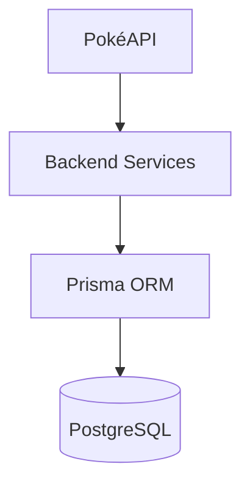
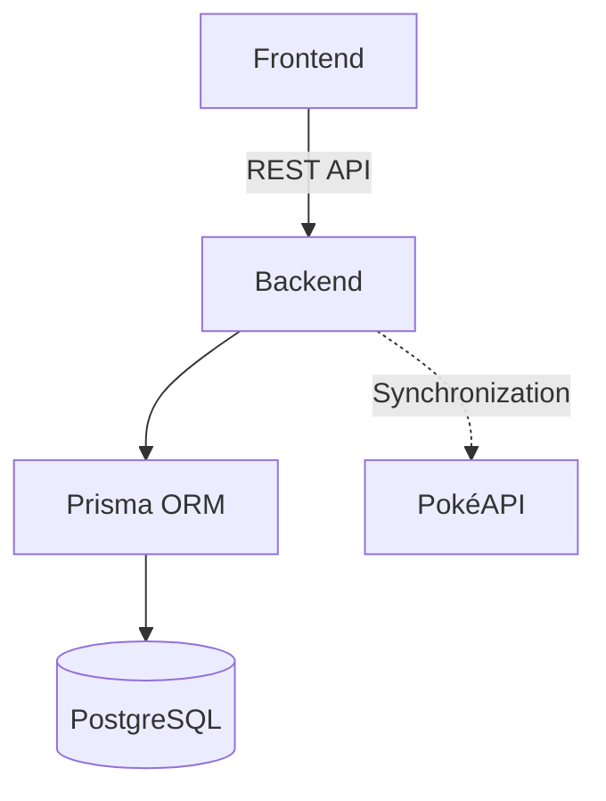
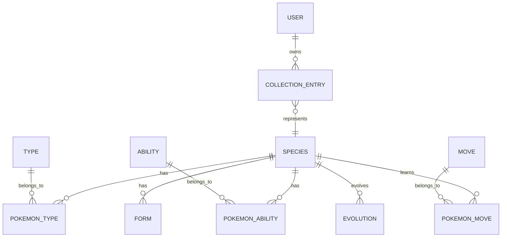
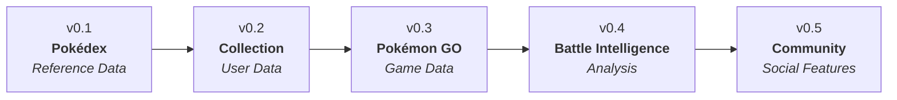

# Database

**Project:** PokéDex Manager *(Working Title)*

**Document:** Database

**Version:** 0.1.0

**Status:** Draft

**Last Updated:** 2026-07-13

---

## Revision History

| Version | Date | Description |
|----------|------------|--------------------------------|
| 0.1.0 | 2026-07-13 | Initial database architecture |

---

## 1. Purpose

This document defines the database architecture of the PokéDex Manager project.

Its purpose is to describe the data model, entity relationships, design principles, naming conventions, and long-term evolution of the application's persistence layer.

The database has been designed to support the project's modular architecture while ensuring data consistency, scalability, and maintainability.

As the project evolves, this document will serve as the primary reference for database design decisions, helping maintain a consistent and well-structured data model across all application modules.

---

### Relationship with Other Documents

This document complements the following project documentation:

- **Vision** — Defines the long-term vision of the project.
- **Requirements** — Defines the functional and non-functional requirements that influence the data model.
- **Architecture** — Defines how the persistence layer integrates with the overall system architecture.
- **Roadmap** — Defines how the database is expected to evolve across future milestones.

---

## 2. Database Overview

PokéDex Manager uses a relational database as the primary persistence layer for application data.

The database is designed to provide a reliable, consistent, and scalable foundation capable of supporting both the current application requirements and future feature expansion.

The project follows a normalized data model, minimizing data duplication while preserving flexibility and maintainability.

Initially, Pokémon data will be synchronized from external services and stored locally, reducing dependency on third-party APIs and improving application performance.

Future versions will extend the database to support user accounts, personal collections, Pokémon GO-specific data, competitive analysis, and community features.

---

### Persistence Architecture

---

### Database Technologies

| Technology | Purpose |
|------------|---------|
| PostgreSQL | Primary relational database management system. |
| Prisma ORM | Type-safe database access and schema management. |
| Prisma Migrate | Database versioning and migration management. |

---

### Persistence Strategy

The application adopts a local-first persistence strategy.

Whenever possible, data should be retrieved from the local database.

External services are used as authoritative data sources for synchronization, ensuring that locally stored information remains up to date while minimizing external dependencies.

This approach improves performance, increases application availability, and provides greater control over the application's data model.

---

## 3. Database Design Principles

The database design of PokéDex Manager follows a set of principles intended to ensure consistency, scalability, maintainability, and long-term data integrity.

These principles should guide the design and evolution of every entity, relationship, and schema modification throughout the project's lifecycle.

---

### Data Integrity

The database shall preserve data consistency through proper relationships, constraints, and referential integrity.

Every record should remain valid and consistent throughout its lifecycle.

---

### Normalization

The data model should minimize redundancy by applying appropriate normalization techniques while maintaining acceptable query performance.

Denormalization should only be considered when justified by performance requirements.

---

### Single Source of Truth

Each piece of information should exist in only one authoritative location within the database.

Duplicated data should be avoided whenever possible.

---

### Referential Integrity

Relationships between entities shall be enforced using foreign keys and database constraints to maintain data consistency.

---

### Scalability

The schema should support future modules and new features without requiring significant structural changes.

New entities should integrate naturally with the existing data model.

---

### Modularity

The database design should reflect the modular architecture of the application.

Entities should be organized according to their business domain, minimizing coupling between different modules.

---

### Performance

The schema should balance normalization and performance.

Indexes and query optimizations should be introduced when necessary without compromising maintainability.

---

### Evolution over Rewrite

The database schema should evolve incrementally through versioned migrations.

Schema changes should prioritize backward compatibility and data preservation whenever possible.

---

### Consistency

Naming conventions, data types, relationships, and database structures should remain consistent across the entire schema.

---

### Documentation First

Every significant schema modification should be documented before implementation.

Database documentation must remain synchronized with the actual schema throughout the project's evolution.

---

### External Data Synchronization

External data should be synchronized into the local database whenever appropriate.

The application should operate primarily from locally persisted data, using external services as authoritative sources for synchronization rather than as real-time dependencies.

---

## 4. Database Architecture

The persistence layer follows a layered architecture that separates business logic, data access, and data storage.

All database operations are performed exclusively through the backend using Prisma ORM, ensuring that the database remains isolated from the frontend and external services.

The backend is responsible for validating requests, applying business rules, synchronizing external data, and managing database persistence.

This architecture promotes maintainability, scalability, and a clear separation of responsibilities across the application.

---

### Persistence Architecture

---

### Persistence Workflow

The persistence layer follows the workflow below:

1. The frontend communicates exclusively with the backend.
2. The backend processes business rules and validation.
3. Prisma ORM acts as the data access layer.
4. PostgreSQL stores the application's persistent data.
5. External services are used only for synchronization when necessary.

---

## 5. Entity Relationship Overview

The following diagrams present the evolution of the PokéDex Manager data model from a conceptual perspective to its physical implementation.

The conceptual model represents the business domain and the relationships between entities, while the physical model documents the database implementation used by the application.

---

### Conceptual Model

The conceptual model focuses on the application's business entities and how they relate to each other.

Implementation details such as attributes, data types, and constraints are intentionally omitted.

---

### Physical Model

The physical model describes how the conceptual entities are implemented within the relational database.

This model includes tables, attributes, primary keys, foreign keys, constraints, and indexes.

The physical model will evolve incrementally as new project milestones are implemented.

---

> **Note:** As the project evolves, logical data models may be introduced to bridge the gap between the conceptual domain model and the physical database implementation.

---

## 6. Version 0.1 Data Model

Version 0.1 establishes the foundation of the PokéDex Manager database.

The initial data model focuses exclusively on Pokémon reference data required to support the Pokédex MVP.

No user-specific or Pokémon GO-specific entities are included in this version.

Future milestones will extend the data model while preserving the relationships established in this initial release.

---

### Core Entities

The following entities compose the initial database schema for version 0.1:

| Entity | Purpose |
|---------|---------|
| Species | Stores the core information for each Pokémon species. |
| Type | Defines Pokémon elemental types. |
| Ability | Stores Pokémon abilities. |
| Move | Stores Pokémon moves. |
| Form | Represents alternative Pokémon forms. |
| Evolution | Defines evolution relationships between species. |

---

### Species

The **Species** entity is the central component of the data model.

It represents a Pokémon species and stores information shared by every instance of that Pokémon.

Future user-owned Pokémon will reference this entity rather than duplicating Pokémon information.

**Responsibilities**

- Identify a Pokémon species.
- Store official Pokédex information.
- Connect to related entities such as Types, Abilities, Moves, Forms, and Evolutions.

---

### Ability

The **Ability** entity stores all Pokémon abilities.

Since abilities are shared among multiple species, they are modeled as an independent entity.

---

### Move

The **Move** entity stores Pokémon moves.

Moves are modeled independently because they are shared across multiple Pokémon species and may support future battle analysis features.

---

### Form

The **Form** entity represents alternative forms of a Pokémon species.

Examples include regional forms and other official form variations.

---

### Evolution

The **Evolution** entity defines evolution relationships between Pokémon species.

This model supports linear, branching, and future evolution scenarios while maintaining flexibility.

---

### Domain Entities

| Entity  | Role             |
| ------- | ---------------- |
| Species | Core Entity      |
| Type    | Reference Entity |
| Ability | Reference Entity |
| Move    | Reference Entity |
| Form    | Reference Entity |

---

### Relationship Entities

| Entity          | Purpose           |
| --------------- | ----------------- |
| Pokemon_Type    | Species ↔ Type    |
| Pokemon_Ability | Species ↔ Ability |
| Pokemon_Move    | Species ↔ Move    |
| Evolution       | Species ↔ Species |

---

## 7. Future Data Model

The database has been designed to evolve incrementally alongside the application's roadmap.

Each milestone introduces new entities and relationships while preserving the integrity and consistency of the existing data model.

Future expansions will extend the database through independent modules rather than modifying the core Pokémon reference data.

---

### Milestone 2 — Personal Collection

The second milestone introduces user-specific data into the application.

Future entities may include:

- User
- Collection Entry
- Favorites

These entities will establish the relationship between users and Pokémon species while keeping the reference data independent from user-owned data.

---

### Milestone 3 — Pokémon GO Integration

The third milestone extends the collection model with Pokémon GO-specific information.

Future entities may include:

- Pokémon GO Data
- Individual Values (IV)
- Combat Power (CP)
- Pokémon Level
- Pokémon Status

These entities will store information specific to individual Pokémon owned by users without affecting the core Pokémon reference model.

---

### Milestone 4 — Battle Intelligence

The fourth milestone introduces entities focused on competitive analysis and gameplay recommendations.

Future entities may include:

- PvP Rankings
- PvE Analysis
- Raid Recommendations
- Moveset Recommendations
- Team Builder

These additions will support advanced analysis features while reusing the existing Pokémon reference data.

---

### Milestone 5 — Community Platform

The fifth milestone expands the database to support community-oriented features.

Future entities may include:

- Events
- News
- Notifications
- Shared Collections

These entities will enable user interaction, content sharing, and community engagement without impacting the core application architecture.

---

### Planned Evolution

---

### Domain-Driven Growth

The database evolves by introducing new business domains rather than modifying existing ones.

Each milestone expands the schema through additional entities and relationships while preserving the stability of previously implemented domains.

This approach minimizes breaking changes, simplifies maintenance, and ensures long-term scalability of the application's data model.

---

## 8. Naming Conventions

The PokéDex Manager database follows a consistent naming convention to improve readability, maintainability, and collaboration.

All database objects should follow these standards unless a documented exception is required.

---

### General Rules

- Use English for all database object names.
- Use lowercase letters only.
- Use `snake_case` for tables, columns, and constraints.
- Use singular names for entities.
- Avoid abbreviations unless they are widely recognized.
- Prefer descriptive names over shortened alternatives.

---

### Tables

Table names represent a single business entity.

| Object | Convention | Example |
|---------|------------|---------|
| Tables | Singular, `snake_case` | `species`, `type`, `ability`, `collection_entry` |

---

### Columns

Column names should clearly describe the stored information.

| Column Type | Convention | Example |
|-------------|------------|---------|
| Primary Key | `id` | `id` |
| Foreign Key | `<entity>_id` | `species_id`, `user_id` |
| Boolean | Prefix with `is_`, `has_`, or `can_` | `is_legendary`, `has_gender_difference` |
| Timestamp | Descriptive | `created_at`, `updated_at` |

---

### Relationship Tables

Many-to-many relationships should use descriptive names based on the related entities.

| Relationship | Example |
|--------------|---------|
| Species ↔ Type | `pokemon_type` |
| Species ↔ Ability | `pokemon_ability` |
| Species ↔ Move | `pokemon_move` |

---

### Constraints

Database constraints should follow consistent prefixes.

| Constraint | Convention |
|------------|------------|
| Primary Key | `pk_<table>` |
| Foreign Key | `fk_<table>_<referenced_table>` |
| Unique | `uq_<table>_<column>` |
| Check | `ck_<table>_<rule>` |

---

### Indexes

Indexes should use descriptive names.

| Index Type | Convention |
|------------|------------|
| Standard | `idx_<table>_<column>` |
| Unique | `uidx_<table>_<column>` |

---

### Prisma Models

Prisma model names should follow PascalCase while mapping to snake_case database tables.

| Prisma Model | Database Table |
|--------------|----------------|
| `Species` | `species` |
| `CollectionEntry` | `collection_entry` |
| `PokemonType` | `pokemon_type` |

---

### Examples

| Database | Prisma |
|-----------|--------|
| `species` | `Species` |
| `pokemon_type` | `PokemonType` |
| `collection_entry` | `CollectionEntry` |
| `created_at` | `createdAt` |

---

### Domain Terminology

Database object names should follow the project's official domain terminology.

Whenever possible, names should remain consistent across:

- Database schema
- Prisma models
- Backend modules
- API endpoints
- Documentation

Examples:

| Domain Term | Database | Prisma |
|-------------|----------|---------|
| Species | `species` | `Species` |
| Collection Entry | `collection_entry` | `CollectionEntry` |
| Pokémon Type | `pokemon_type` | `PokemonType` |

---

## 9. Migration Strategy

The PokéDex Manager database evolves through incremental, version-controlled migrations.

Each schema modification should be implemented using Prisma Migrate, ensuring that every database change is reproducible, traceable, and consistent across development environments.

The migration history becomes part of the project's documentation, preserving the evolution of the database throughout the application's lifecycle.

---

### Migration Principles

Database migrations should follow these principles:

- Apply incremental schema changes.
- Preserve existing data whenever possible.
- Maintain backward compatibility when feasible.
- Keep migrations focused on a single logical change.
- Version every structural modification.
- Test migrations before deployment.

---

### Schema Evolution

Database changes should follow the project's roadmap and architectural milestones.

Each new milestone introduces additional entities and relationships without requiring unnecessary modifications to previously established domains.

Whenever possible, new functionality should extend the existing schema rather than replacing it.

---

### Data Preservation

Database migrations should prioritize preserving application data.

Destructive operations such as dropping tables or removing columns should only occur when absolutely necessary and must be documented appropriately.

Whenever data transformations are required, migration scripts should ensure a safe transition between schema versions.

---

### Migration Workflow

The expected database evolution workflow is:

1. Update the database documentation.
2. Update the Prisma schema.
3. Generate a new migration.
4. Review the generated migration.
5. Apply the migration locally.
6. Validate the updated schema.
7. Commit both the schema and migration files.

---

### Version Control

All migration files must be tracked using Git.

Migration history should never be rewritten or deleted after being committed, ensuring a complete and auditable record of the database's evolution.

---

### Documentation Before Implementation

Any structural database modification should be documented before implementation.

The database documentation, architecture documentation, and Prisma schema should remain synchronized throughout the project's lifecycle.

This approach ensures that design decisions are reviewed before implementation, reducing technical debt and preserving the long-term consistency of the application.

---

## 10. Approval

This document defines the official database architecture of the PokéDex Manager project.

All database design decisions, entity relationships, naming conventions, and migration strategies should follow the principles and standards established in this document.

Future revisions should preserve the consistency, integrity, and scalability of the application's data model while remaining aligned with the project's overall architecture and long-term vision.