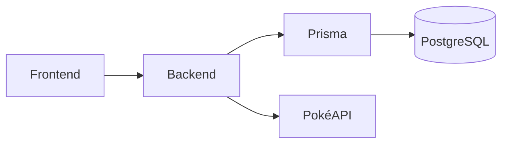
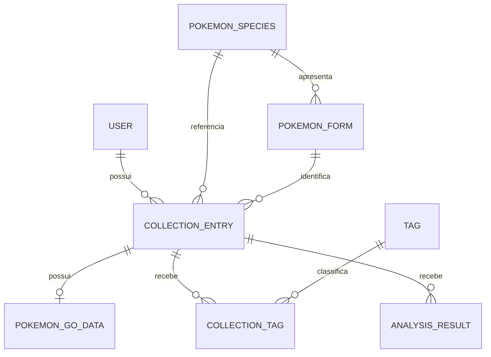

# Banco de dados

> Estado atual: o banco de dados ainda não foi implementado.

Este documento registra o planejamento inicial da futura camada de persistência da Minha Pokédex.

O modelo apresentado aqui é conceitual. Entidades, atributos e relacionamentos poderão ser revisados antes da implementação, conforme os requisitos do backend e da coleção pessoal forem definidos.

## Objetivo

O banco de dados será introduzido quando a aplicação precisar armazenar informações próprias, como:

- contas de usuário;
- coleções pessoais;
- favoritos;
- preferências;
- dados individuais de Pokémon;
- informações específicas de Pokémon GO;
- resultados de análises e recomendações.

A versão atual da Pokédex utiliza diretamente a PokéAPI e não persiste dados.

## Tecnologias planejadas

| Tecnologia        | Responsabilidade                      |
| ----------------- | ------------------------------------- |
| PostgreSQL        | Banco de dados relacional             |
| Prisma            | Modelagem e acesso aos dados          |
| Prisma Migrate    | Controle das alterações do schema     |
| Node.js e Express | Backend responsável pela persistência |

Essas tecnologias ainda não fazem parte da aplicação em funcionamento e poderão ser reavaliadas antes da implementação.

## Arquitetura planejada

O frontend não deverá acessar o banco de dados diretamente.

```text
Frontend
→ API da Minha Pokédex
→ Services
→ Prisma
→ PostgreSQL
```


```mermaid
flowchart LR
    F[Frontend]
    B[Backend]
    P[Prisma]
    DB[(PostgreSQL)]
    API[PokéAPI]

    F --> B
    B --> P
    P --> DB
    B --> API
```

O backend será responsável por:

- validar dados;
- aplicar regras de negócio;
- autenticar usuários;
- autorizar operações;
- consultar e alterar registros;
- integrar dados externos;
- controlar a consistência das informações.

## Estratégia inicial

A persistência deve ser introduzida de forma incremental.

A ordem prevista é:

```text
estrutura do backend
→ usuários e autenticação
→ coleção pessoal
→ dados de Pokémon GO
→ análises e recomendações
```

Não é necessário copiar imediatamente todo o conteúdo da PokéAPI para o banco de dados.

A decisão entre consultar dados externos em tempo real, armazená-los localmente ou utilizar cache deverá considerar:

- necessidade do produto;
- disponibilidade da fonte externa;
- frequência de atualização;
- desempenho;
- custo de manutenção;
- licenciamento e origem dos dados.

## Domínios planejados

### Referência Pokémon

Representa informações gerais sobre espécies, formas e dados compartilhados.

Possíveis entidades:

- `PokemonSpecies`;
- `PokemonForm`;
- `PokemonType`;
- `Ability`;
- `Move`;
- `Evolution`.

Esses dados poderão ser:

- consultados diretamente em serviços externos;
- armazenados parcialmente;
- sincronizados;
- mantidos em cache.

A estratégia definitiva ainda não foi escolhida.

### Usuários

Representa as contas da aplicação.

Possíveis responsabilidades:

- identificação;
- autenticação;
- preferências;
- datas de criação e atualização;
- relacionamento com a coleção pessoal.

### Coleção pessoal

Representa os Pokémon registrados por cada usuário.

Uma entrada da coleção não deve duplicar todos os dados gerais da espécie.

Ela deve referenciar a espécie ou forma correspondente e armazenar somente os dados pertencentes ao Pokémon do usuário.

Possíveis informações:

- apelido;
- forma;
- shiny;
- sortudo;
- sombra;
- purificado;
- favorito;
- observações;
- data de captura;
- tags;
- status de investimento.

### Dados de Pokémon GO

Representa atributos específicos de um Pokémon capturado no jogo.

Possíveis informações:

- IV de ataque;
- IV de defesa;
- IV de stamina;
- CP;
- nível;
- gênero;
- moveset;
- fundo especial;
- forma especial;
- Mega Evolução disponível;
- estado de evolução.

Esses atributos pertencem ao Pokémon registrado pelo usuário, e não à espécie de forma geral.

### Análises

Representa informações calculadas ou recomendações produzidas pela aplicação.

Possíveis dados:

- avaliação para PvP;
- avaliação para PvE;
- prioridade para raids;
- recomendação de moveset;
- indicação de investimento;
- posição em rankings;
- data e origem da análise.

Antes da implementação, será necessário decidir quais resultados devem ser persistidos e quais podem ser calculados sob demanda.

## Modelo conceitual inicial

O modelo abaixo apresenta apenas os principais relacionamentos esperados.


```mermaid
erDiagram
    USER ||--o{ COLLECTION_ENTRY : possui
    POKEMON_SPECIES ||--o{ POKEMON_FORM : apresenta
    POKEMON_SPECIES ||--o{ COLLECTION_ENTRY : referencia
    POKEMON_FORM ||--o{ COLLECTION_ENTRY : identifica
    COLLECTION_ENTRY ||--o| POKEMON_GO_DATA : possui
    COLLECTION_ENTRY ||--o{ COLLECTION_TAG : recebe
    TAG ||--o{ COLLECTION_TAG : classifica
    COLLECTION_ENTRY ||--o{ ANALYSIS_RESULT : recebe
```

Este diagrama não representa um schema definitivo.

## Entidades preliminares

### `User`

Representa uma conta da aplicação.

Campos preliminares:

```text
id
name
email
password_hash
created_at
updated_at
```

O formato de autenticação e os dados obrigatórios serão definidos durante a implementação do backend.

### `PokemonSpecies`

Representa uma espécie de Pokémon.

Campos preliminares:

```text
id
external_id
name
created_at
updated_at
```

Outros dados poderão continuar sendo obtidos externamente em vez de armazenados localmente.

### `PokemonForm`

Representa uma forma associada a uma espécie.

Campos preliminares:

```text
id
species_id
external_id
name
is_default
created_at
updated_at
```

### `CollectionEntry`

Representa um Pokémon pertencente à coleção de um usuário.

Campos preliminares:

```text
id
user_id
species_id
form_id
nickname
is_favorite
notes
captured_at
created_at
updated_at
```

### `PokemonGoData`

Representa os atributos específicos de Pokémon GO associados a uma entrada da coleção.

Campos preliminares:

```text
id
collection_entry_id
attack_iv
defense_iv
stamina_iv
combat_power
pokemon_level
is_shiny
is_lucky
is_shadow
is_purified
fast_move
charged_move
created_at
updated_at
```

Os valores e restrições desses campos deverão ser validados conforme as regras reais do jogo.

### `Tag`

Permite que o usuário organize sua coleção.

Campos preliminares:

```text
id
user_id
name
created_at
updated_at
```

### `CollectionTag`

Relaciona entradas da coleção e tags.

Campos preliminares:

```text
collection_entry_id
tag_id
```

### `AnalysisResult`

Pode armazenar resultados de análises realizadas para uma entrada da coleção.

Campos preliminares:

```text
id
collection_entry_id
analysis_type
result
source
calculated_at
```

A necessidade dessa entidade deverá ser confirmada antes da implementação.

## Convenções de nomenclatura

### Banco de dados

- nomes em inglês;
- letras minúsculas;
- `snake_case`;
- nomes de tabelas no singular;
- chaves primárias chamadas `id`;
- chaves estrangeiras no formato `<entity>_id`;
- datas no formato `<action>_at`.

Exemplos:

```text
app_user
pokemon_species
collection_entry
pokemon_go_data
created_at
updated_at
```

### Prisma

Os modelos utilizarão `PascalCase`.

Exemplos:

| Prisma            | PostgreSQL         |
| ----------------- | ------------------ |
| `User`            | `app_user`         |
| `PokemonSpecies`  | `pokemon_species`  |
| `CollectionEntry` | `collection_entry` |
| `PokemonGoData`   | `pokemon_go_data`  |

Campos no código utilizarão `camelCase` e poderão ser mapeados para `snake_case` no banco.

Exemplo:

```text
createdAt → created_at
speciesId → species_id
```

## Identificadores

Cada tabela deverá possuir uma chave primária interna.

Identificadores vindos de serviços externos não devem ser utilizados automaticamente como chave primária da aplicação.

Exemplo:

```text
id
→ identificador interno

external_id
→ identificador da PokéAPI ou de outra fonte
```

Essa separação permite:

- trocar a fonte externa;
- integrar mais de uma fonte;
- evitar dependência direta de identificadores externos;
- manter relacionamentos internos estáveis.

## Integridade dos dados

Quando a camada de persistência for implementada, devem ser utilizados:

- chaves primárias;
- chaves estrangeiras;
- restrições de unicidade;
- campos obrigatórios;
- validações de intervalo;
- exclusão controlada;
- transações quando necessárias.

Exemplos de regras possíveis:

- o e-mail do usuário deve ser único;
- uma entrada da coleção deve pertencer a um usuário;
- IVs devem respeitar os limites válidos;
- uma forma deve pertencer a uma espécie;
- uma tag deve pertencer ao usuário que a criou.

As regras definitivas serão registradas junto ao schema real.

## Dados sensíveis

O banco poderá armazenar informações de usuários em versões futuras.

Devem ser protegidos:

- senhas;
- tokens;
- dados de autenticação;
- informações privadas da coleção;
- dados pessoais.

Senhas nunca devem ser armazenadas em texto simples.

Credenciais, URLs privadas e segredos não devem ser registrados no repositório.

As políticas de autenticação, autorização e privacidade serão definidas antes da implementação.

## Migrations

Toda mudança estrutural deverá ser registrada por migrations versionadas.

Fluxo esperado:

```text
alterar o schema
→ gerar migration
→ revisar SQL e impacto
→ aplicar localmente
→ validar dados
→ registrar a mudança
→ versionar junto ao código
```

Regras:

- não alterar manualmente um banco compartilhado sem migration;
- não editar migrations já aplicadas em ambientes compartilhados;
- utilizar nomes descritivos;
- revisar perda ou transformação de dados;
- manter schema, código e documentação sincronizados.

Exemplos:

```text
create_user
create_collection_entry
add_pokemon_go_data
add_collection_tags
```

## Seeds

Seeds poderão ser utilizados para:

- dados mínimos de desenvolvimento;
- tipos de análise;
- configurações iniciais;
- dados de referência estáveis.

Seeds não devem ser tratados como substitutos de migrations.

Dados extensos vindos da PokéAPI não devem ser incluídos automaticamente no repositório sem avaliação.

## Ambientes

A aplicação poderá utilizar bancos separados para:

```text
development
test
production
```

Cada ambiente deverá possuir configuração própria.

O banco de produção não deve ser utilizado diretamente para desenvolvimento ou testes locais.

## Backup e recuperação

Antes da publicação com dados reais, será necessário definir:

- frequência de backup;
- período de retenção;
- armazenamento seguro;
- restauração;
- validação periódica dos backups;
- responsabilidade operacional.

Essas decisões ainda não fazem parte do estado atual do projeto.

## Pendências antes da implementação

Antes de criar o schema definitivo, precisamos definir:

- método de autenticação;
- dados obrigatórios do usuário;
- estrutura da coleção pessoal;
- tratamento de formas e variações;
- origem dos dados de Pokémon GO;
- campos realmente necessários para IV, CP e nível;
- estratégia para movesets;
- necessidade de armazenar dados da PokéAPI;
- política de cache e sincronização;
- regras de exclusão da conta;
- privacidade da coleção;
- escopo inicial do backend.

## Critério para iniciar

A implementação do banco de dados deve começar quando:

- o Milestone correspondente estiver planejado;
- os requisitos da coleção pessoal estiverem definidos;
- o backend possuir uma estrutura inicial;
- as principais entidades estiverem validadas;
- as regras de autenticação e propriedade dos dados estiverem claras.

Até esse momento, este documento representa somente uma direção técnica inicial.
