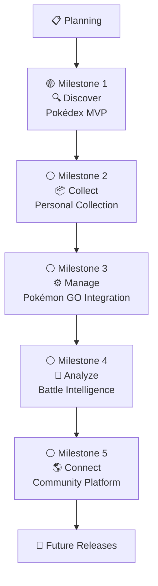

# Roadmap

**Project:** PokéDex Manager _(Working Title)_

**Document:** Roadmap

**Version:** 0.1.1

**Status:** Draft

**Last Updated:** 2026-07-22

---

## Revision History

| Version | Date       | Description                                         |
| ------- | ---------- | --------------------------------------------------- |
| 0.1.0   | 2026-07-13 | Initial project roadmap                             |
| 0.1.1   | 2026-07-22 | Updated Sprint 1 and Milestone 1 development status |

---

## 1. Purpose

The purpose of this roadmap is to define the planned evolution of the PokéDex Manager project.

Rather than serving as a simple task list, this roadmap represents the long-term product vision, organizing development into milestones that deliver meaningful value to users.

Each milestone introduces a new capability while preserving the project's architectural consistency and incremental development strategy.

---

## 2. Development Strategy

The project follows an iterative and incremental development approach.

Each milestone focuses on delivering a complete, usable feature set rather than isolated technical tasks.

Every version should provide measurable value to the end user and serve as a stable foundation for future development.

The roadmap is expected to evolve over time as the project grows and new requirements emerge.

---

## 3. Development Philosophy

The development of PokéDex Manager is guided by the following principles:

- Deliver value incrementally.
- Maintain architectural consistency.
- Prioritize code quality over development speed.
- Document architectural decisions.
- Keep the project modular and scalable.
- Continuously improve through small iterations.
- Avoid unnecessary complexity.
- Build with future expansion in mind.

---

## 4. Roadmap Overview

The following roadmap presents the planned evolution of the PokéDex Manager project.

Each milestone represents a significant product increment, delivering a complete set of features that provide value to the end user.

Development follows an incremental approach, allowing the project to evolve while maintaining architectural consistency and software quality.



---

## 5. Project Progress

### Milestone Status

| Icon | Status      | Description                                                 |
| ---- | ----------- | ----------------------------------------------------------- |
| ⚪   | Planned     | The milestone is planned but development has not started.   |
| 🟡   | In Progress | The milestone is currently under development.               |
| 🟢   | Completed   | The milestone has been successfully completed and released. |

---

### Current Progress

| Milestone   | Theme       | Status         |
| ----------- | ----------- | -------------- |
| Milestone 1 | 🔍 Discover | 🟡 In Progress |
| Milestone 2 | 📦 Collect  | ⚪ Planned     |
| Milestone 3 | ⚙️ Manage   | ⚪ Planned     |
| Milestone 4 | 🧠 Analyze  | ⚪ Planned     |
| Milestone 5 | 🌎 Connect  | ⚪ Planned     |

---

### Sprint Progress

| Sprint   | Scope                    | Status       | Result                                                                                                   |
| -------- | ------------------------ | ------------ | -------------------------------------------------------------------------------------------------------- |
| Sprint 0 | Project Setup            | 🟢 Completed | Monorepo, frontend foundation, development tools, code quality standards, and project configuration.     |
| Sprint 1 | Frontend Foundation      | 🟢 Completed | Routing, application layout, Design System, PokéAPI integration, listing, search, details, and feedback. |
| Sprint 2 | Milestone 1 Continuation | ⚪ Planned   | UI/UX refinement, navigation restructuring, remaining MVP information, and technical improvements.       |

---

## 6. Milestone Structure

Each project milestone follows the same structure to ensure consistency throughout the development lifecycle.

Every milestone represents a meaningful product increment rather than a collection of isolated technical tasks.

The objective is to deliver complete user-facing capabilities while preserving the project's architectural integrity and long-term vision.

Each milestone contains the following sections:

| Section          | Description                                            |
| ---------------- | ------------------------------------------------------ |
| Goal             | Defines the primary objective of the milestone.        |
| Versions         | Lists the project versions included in the milestone.  |
| Features         | Describes the major functionality introduced.          |
| Deliverables     | Specifies the expected outcome of the milestone.       |
| Success Criteria | Defines when the milestone can be considered complete. |

---

## 7. Milestone 1 — Pokédex MVP

**Status:** 🟡 In Progress

---

### Overview

The first milestone focuses on delivering a complete Pokédex experience.

This milestone establishes the foundation of the application by allowing users to search for Pokémon and explore their core information through a responsive and intuitive interface.

---

### Goal

Deliver a complete Pokédex experience without requiring user authentication or personal data management.

---

### Versions

- v0.1.0

---

### Features

- Pokémon Search
- Pokémon Details
- Responsive Interface

---

### Deliverables

- Search Pokémon by name.
- Search Pokémon by Pokédex number.
- Browse available Pokémon.
- Display official artwork and sprites.
- Display Pokémon types.
- Display base stats.
- Display abilities.
- Display evolution chain.
- Display available forms.
- Display Pokédex description.

---

### Current Delivery Status

| Deliverable                      | Status         | Notes                                                                     |
| -------------------------------- | -------------- | ------------------------------------------------------------------------- |
| Search Pokémon by name           | 🟢 Completed   | Search is currently applied to the loaded Pokémon list.                   |
| Search Pokémon by Pokédex number | 🟢 Completed   | Supports numeric searches such as `1`, `001`, and `#001`.                 |
| Browse available Pokémon         | 🟡 In Progress | The initial set is available; pagination and broader loading are pending. |
| Display official artwork         | 🟢 Completed   | Official artwork is displayed in listing and details.                     |
| Display sprites                  | ⚪ Planned     | Not implemented yet.                                                      |
| Display Pokémon types            | 🟢 Completed   | Types are validated and displayed through TypeBadge.                      |
| Display base stats               | 🟢 Completed   | Base stats include accessible progress indicators.                        |
| Display abilities                | 🟢 Completed   | Regular and hidden abilities are displayed.                               |
| Display evolution chain          | ⚪ Planned     | Not implemented yet.                                                      |
| Display available forms          | ⚪ Planned     | Not implemented yet.                                                      |
| Display Pokédex description      | ⚪ Planned     | Not implemented yet.                                                      |
| Responsive interface             | 🟢 Completed   | Validated from 320px through desktop resolutions.                         |
| Loading, empty, and error states | 🟢 Completed   | Includes request cancellation and retry support.                          |

> The search implemented during Sprint 1 operates on the Pokémon currently
> loaded by the application. Full-dataset search, pagination, or API-driven
> search will be addressed during the continuation of Milestone 1.

---

### Success Criteria

The milestone is considered complete when users can search for Pokémon and access all planned information through a responsive interface.

---

### Dependencies

None.

---

### Notes

This milestone intentionally excludes user authentication, personal collections, and Pokémon GO-specific features.

These capabilities will be introduced in future milestones.

---

### User Value

At the end of this milestone, users will be able to explore Pokémon information quickly and intuitively through a modern web application.

---

## 8. Milestone 2 — Personal Collection

**Status:** ⚪ Planned

---

### Overview

The second milestone introduces user accounts and personal collection management.

This milestone transforms the application from a public Pokédex into a personalized platform where users can build and manage their own Pokémon collection.

---

### Goal

Enable users to securely manage their personal Pokémon collection.

---

### Versions

- v0.2.0

---

### Features

- User Authentication
- User Registration
- Personal Collection
- Favorites

---

### Deliverables

- User registration.
- User authentication.
- Secure login and logout.
- Personal Pokémon collection.
- Add Pokémon to the collection.
- Edit collection entries.
- Remove Pokémon from the collection.
- Mark Pokémon as favorites.

---

### Success Criteria

The milestone is considered complete when authenticated users can create and manage their own Pokémon collection.

---

### Dependencies

- Milestone 1 — Pokédex MVP

---

### Notes

This milestone introduces the first persistent user data stored in the application's database.

---

### User Value

At the end of this milestone, users will be able to create an account and maintain their own personalized Pokémon collection.

---

## 9. Milestone 3 — Pokémon GO Integration

**Theme:** Analyze

**Status:** ⚪ Planned

---

### Overview

The third milestone introduces Pokémon GO-specific features, transforming the application from a traditional Pokédex into a companion platform for Pokémon GO players.

Users will be able to register game-specific information, analyze their Pokémon, and make more informed decisions about which Pokémon to keep and invest in.

---

### Goal

Provide tools to manage and analyze Pokémon GO data through a personalized and intuitive experience.

---

### Versions

- v0.3.0

---

### Features

- Pokémon GO Data
- IV Management
- CP Management
- Level Tracking
- Pokémon Status
- GO Availability

---

### Deliverables

- Register Pokémon IVs.
- Register Combat Power (CP).
- Register Pokémon Level.
- Mark Pokémon as Shiny.
- Mark Pokémon as Lucky.
- Mark Pokémon as Shadow.
- Mark Pokémon as Purified.
- Display Pokémon GO availability.
- Display Mega Evolution availability.
- Display Pokémon GO exclusive information.

---

### Success Criteria

The milestone is considered complete when users can register and manage Pokémon GO-specific information for their personal collection.

---

### Dependencies

- Milestone 1 — Pokédex MVP
- Milestone 2 — Personal Collection

---

### Notes

This milestone marks the transition from a general Pokémon encyclopedia to a dedicated Pokémon GO companion application.

Future competitive analysis features will build upon the data introduced in this milestone.

---

### User Value

At the end of this milestone, users will be able to organize and analyze their Pokémon GO collection using information specific to the game.

---

## 10. Milestone 4 — Competitive Analysis

**Theme:** Analyze

**Status:** ⚪ Planned

---

### Overview

The fourth milestone introduces competitive analysis features, enabling users to evaluate their Pokémon for different gameplay scenarios.

The application evolves from a collection manager into a decision-support platform, helping players determine where each Pokémon performs best.

---

### Goal

Provide intelligent analysis and recommendations for Pokémon GO gameplay.

---

### Versions

- v0.4.0

---

### Features

- PvP Analysis
- PvE Analysis
- Raid Analysis
- Gym Analysis
- Team GO Rocket Analysis
- Move Recommendations

---

### Deliverables

- Display PvP rankings.
- Display recommended PvP leagues.
- Display PvE effectiveness.
- Display raid performance.
- Display gym performance.
- Display Team GO Rocket recommendations.
- Display recommended movesets.
- Compare Pokémon performance.
- Display strengths and weaknesses for different game modes.

---

### Success Criteria

The milestone is considered complete when users can evaluate their Pokémon and receive recommendations for the main Pokémon GO game modes.

---

### Dependencies

- Milestone 1 — Pokédex MVP
- Milestone 2 — Personal Collection
- Milestone 3 — Pokémon GO Integration

---

### Notes

This milestone introduces decision-support features based on Pokémon GO data.

The recommendations should help users optimize resource investment and team composition.

---

### User Value

At the end of this milestone, users will be able to make informed decisions about which Pokémon to power up, evolve, and use in different Pokémon GO activities.

---

## 11. Milestone 5 — Community Platform

**Theme:** Connect

**Status:** ⚪ Planned

---

### Overview

The fifth milestone transforms PokéDex Manager into a collaborative platform, enabling users to interact with the community, share information, and stay informed about Pokémon GO events and updates.

This milestone extends the application beyond personal collection management, fostering engagement and collaboration among players.

---

### Goal

Provide community-driven features that enhance collaboration, communication, and knowledge sharing among Pokémon GO players.

---

### Versions

- v0.5.0

---

### Features

- Event Calendar
- News
- Notifications
- Community Features
- Collection Sharing

---

### Deliverables

- Display upcoming Pokémon GO events.
- Display game news and announcements.
- Notify users about relevant events.
- Share personal collections.
- Generate shareable Pokémon profiles.
- Support community-driven content.
- Enable future social features.

---

### Success Criteria

The milestone is considered complete when users can access community content, stay informed about Pokémon GO events, and share their collections with others.

---

### Dependencies

- Milestone 1 — Pokédex MVP
- Milestone 2 — Personal Collection
- Milestone 3 — Pokémon GO Integration
- Milestone 4 — Battle Intelligence

---

### Notes

This milestone marks the transition from a personal management tool to a community-oriented platform.

Additional collaborative features may be introduced in future versions.

---

### User Value

At the end of this milestone, users will be able to connect with the Pokémon GO community, stay informed about game updates, and share their progress with other players.

---

## 12. User Journey

The roadmap follows the natural progression of a Pokémon GO player's experience.

```text
Discover
     ↓
Collect
     ↓
Manage
     ↓
Analyze
     ↓
Connect
```

Each milestone builds upon the previous one, gradually transforming PokéDex Manager from a Pokémon encyclopedia into a complete companion platform for Pokémon GO players.

---

## 13. Future Releases

The roadmap presented in this document represents the current long-term vision for the PokéDex Manager project.

As the project evolves, additional milestones, modules, and features may be introduced based on user feedback, technical improvements, and new Pokémon GO mechanics.

Future releases should continue to follow the project's architectural principles, documentation standards, and incremental development strategy.

Potential future areas include:

- AI-assisted recommendations.
- Trading management.
- Achievement tracking.
- Advanced statistics and analytics.
- Multi-platform support.
- Third-party integrations.
- Offline functionality.
- Performance optimizations.

The roadmap is a living document and should be reviewed and updated as the project evolves.

---

## 14. Approval

This document defines the official development roadmap of the PokéDex Manager project.

The roadmap should be used as a strategic guide for planning, prioritizing, and tracking the project's evolution.

Future revisions should preserve the project's long-term vision while remaining flexible enough to accommodate new opportunities and changing requirements.

---
